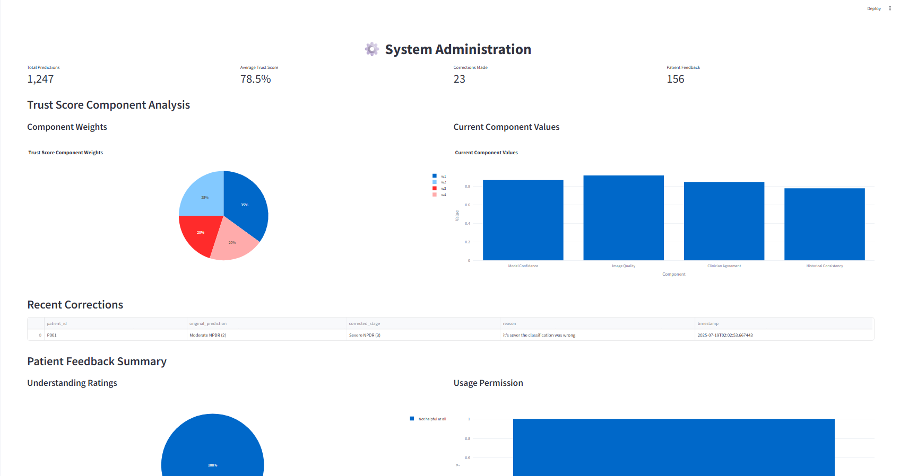
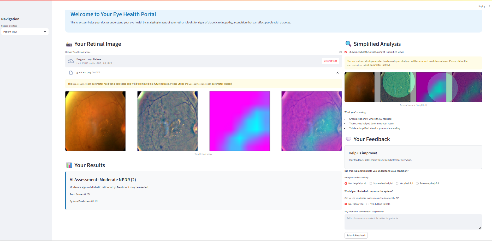
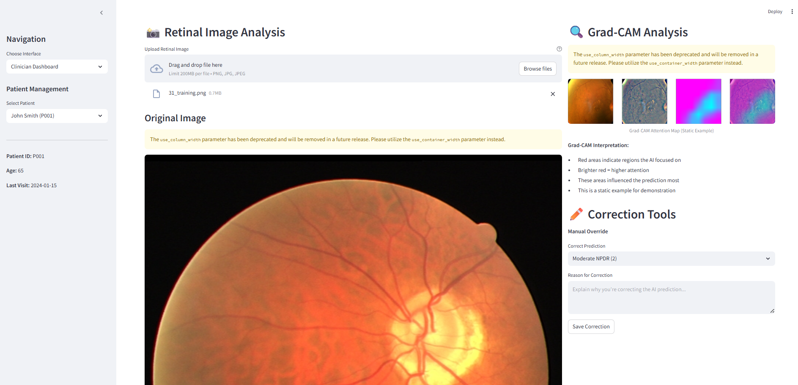
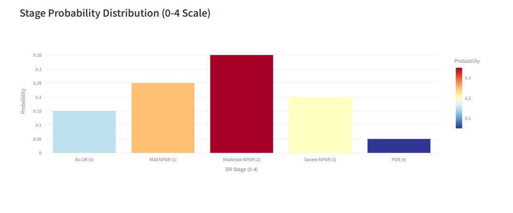

# DR Stage Prediction System - User Engagement & Participatory Design Interface

This Streamlit application provides interactive interfaces for both clinicians and patients in a Diabetic Retinopathy (DR) stage prediction system, implementing participatory design principles with bi-directional feedback loops.

## Features

### 👨‍⚕️ Clinician Dashboard
- **DR Stage Prediction**: AI-powered stage classification with confidence scores
- **Trust Score**: Reliability indicator for AI predictions
- **Grad-CAM Visualization**: Detailed attention maps showing AI focus areas
- **Correction Tools**: Manual override capabilities with reasoning
- **Patient Management**: Patient selection and history tracking
- **Probability Distribution**: Visual representation of prediction confidence across stages

### 👤 Patient View
- **Friendly Explanations**: Patient-friendly language for medical results
- **Simplified Heatmap**: Optional simplified visualization of AI attention areas
- **Feedback Form**: Two key questions:
  - "Did this explanation help you understand your condition?"
  - "Do you allow us to use your image to help improve the system?"
- **Educational Content**: Clear explanations of diabetic retinopathy stages

### ⚙️ Admin Panel
- **System Monitoring**: Real-time statistics and metrics
- **Correction Tracking**: Monitor clinician corrections and reasoning
- **Feedback Analytics**: Patient feedback analysis and visualization
- **Performance Metrics**: Trust scores and prediction accuracy tracking

## Installation

1. **Clone or download the project files**

2. **Install dependencies**:
   ```bash
   pip install -r requirements.txt
   ```

3. **Run the application**:
   ```bash
   streamlit run interface.py
   ```

4. **Open your browser** and navigate to the URL shown in the terminal (typically `http://localhost:8501`)

## Usage

### For Clinicians
1. Select "Clinician Dashboard" from the navigation
2. Choose a patient from the sidebar
3. Upload a retinal fundus image
4. Review AI predictions, trust scores, and Grad-CAM visualizations
5. Use correction tools if needed to override AI predictions
6. Provide reasoning for corrections to improve the system

### For Patients
1. Select "Patient View" from the navigation
2. Upload your retinal image
3. Review your results in patient-friendly language
4. Optionally view simplified heatmap visualization
5. Provide feedback on explanation helpfulness
6. Choose whether to allow image usage for system improvement

### For Administrators
1. Select "Admin Panel" from the navigation
2. Monitor system performance metrics
3. Review clinician corrections and patient feedback
4. Analyze feedback patterns and system improvements

## Technical Details

### Static Demonstration Data
- The application uses static demonstration data for consistency
- Predictions show fixed example values (Moderate NPDR with 87% confidence)
- Trust score is calculated using the formula: w₁×C + w₂×Q + w₃×A + w₄×H
- DR stage probabilities are fixed: No DR (15%), Mild NPDR (25%), Moderate NPDR (35%), Severe NPDR (20%), PDR (5%)
- Grad-CAM visualization uses a static image from the images folder
- Patient data and feedback are stored in session state

### Key Components
- **Trust Score Calculation**: Uses formula w₁×C + w₂×Q + w₃×A + w₄×H with weights [0.35, 0.25, 0.20, 0.20]
- **Static Grad-CAM**: Uses gradcam.png from images folder
- **Simplified Heatmap**: Patient-friendly visualization
- **Feedback Collection**: Structured feedback forms
- **Data Persistence**: Session-based data storage

### Customization
- Modify `generate_mock_prediction()` to integrate with real AI models
- Update `create_gradcam_visualization()` for actual Grad-CAM implementation
- Customize patient explanations in `stage_explanations` dictionary
- Adjust styling in the CSS section

## Participatory Design Features

### Bi-directional Feedback Loop
1. **Clinician Corrections**: Doctors can override AI predictions and provide reasoning
2. **Patient Feedback**: Patients rate explanation helpfulness and grant usage permissions
3. **System Improvement**: Feedback data is collected to improve AI model performance
4. **Trust Building**: Transparent explanations and optional visualizations build patient trust

### Fairness and Data Quality
- Patient consent for image usage
- Anonymous feedback collection
- Clinician oversight and correction capabilities
- Transparent AI decision-making process

## Screenshots

### 👤 Admin Portal

*Admin Page showing corrections of the clincian and the weight for calculating trust along with patient satisfcations and consents and more statical featuers*

### 👤 Patient Portal

*Patient-friendly interface with simplified explanations and feedback form Patient view showing AI assessment results with trust score and confidence level*

### 👨‍⚕️ Clinician Dashboard - Main View

*Main clinician dashboard with patient management and image upload*

### 🔍 Clinician Dashboard - AI Prediction Results

*AI prediction results with trust score calculation and component breakdown*

### 📈 Clinician Dashboard - Probability Distribution

*DR stage probability distribution chart (0-4 scale) with confidence metrics*


## Contributing

To extend this system:
1. Integrate with real AI models for DR prediction
2. Implement actual Grad-CAM visualization
3. Add database connectivity for persistent data storage
4. Enhance security and privacy features
5. Add more detailed patient education materials

## License

This project is for educational and research purposes. Please ensure compliance with relevant medical data privacy regulations when deploying in clinical settings. 

Developed By Mohamed Hafez